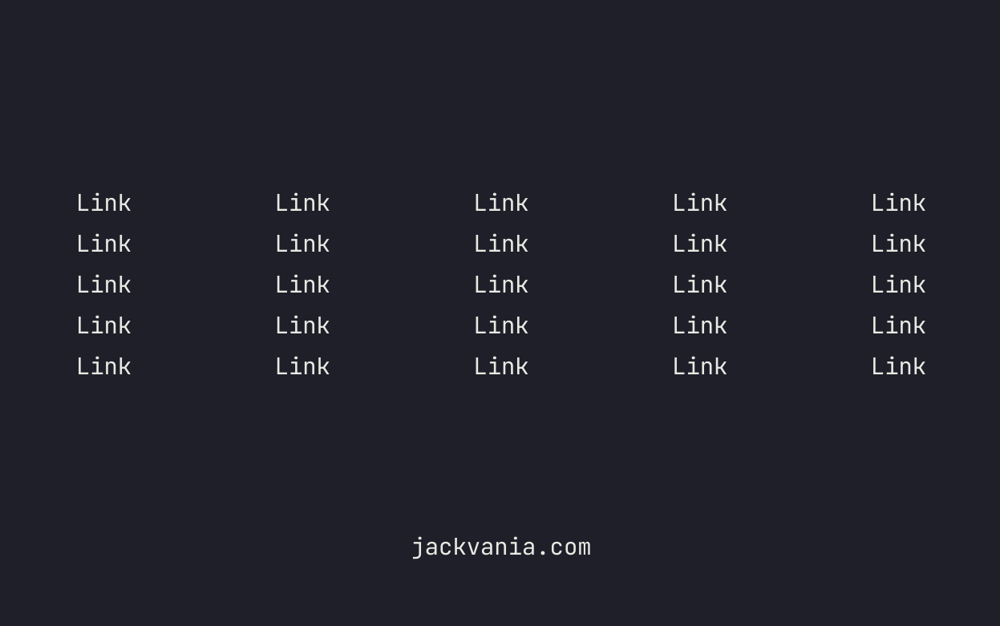

# BrowswerTab
Customizable HTML 5-column layout for home page or whatever you like.

## CSS
Customize CSS for overall width, column width, colors, etc.

## HTML
Easy to edit HTML. Just duplicate a line in any column and add your own links.

## Favicon
Keep it, replace it, remove it.

## Bottom Anchor
Remove if you wish. It's just my site.

## Usage
Just place the directory on your drive somewhere and point your browser's New Tab page to home.html in that folder.

## Editing
Any text editor will suffice.
