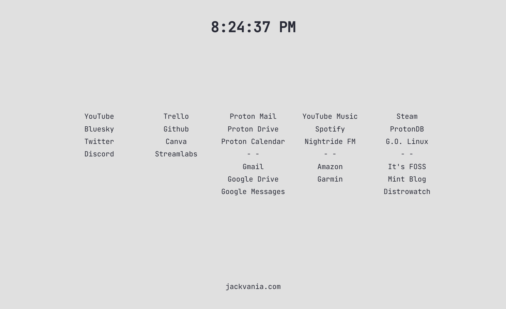

# New Browswer Tab
Customizable HTML 5-column layout for home page or whatever you like with large display clock.

## Why?
It's not a browser extension so it will work in all browsers: you can edit the HTML and take it with you from browser to browser.

## CSS
Customize CSS for overall width, column width, colors, etc.

## HTML
Easy to edit HTML. Just duplicate a line in any column and add your own links.

## Favicon
Keep it, replace it, remove it.

## Bottom Anchor
Remove if you wish. It's just my site.

## Top Anchor
Holds the clock. Click the clock to go to the clock page for a large clock on blank screen.

## Font
This template uses Jetbrains Mono FOSS: https://www.jetbrains.com/lp/mono/

## Usage
Just place the directory on your drive somewhere and point your browser's New Tab page to home.html in that folder.

## Editing
Any text editor will suffice. Column widths are hard-coded and center floating. Change font size and width as you like.
